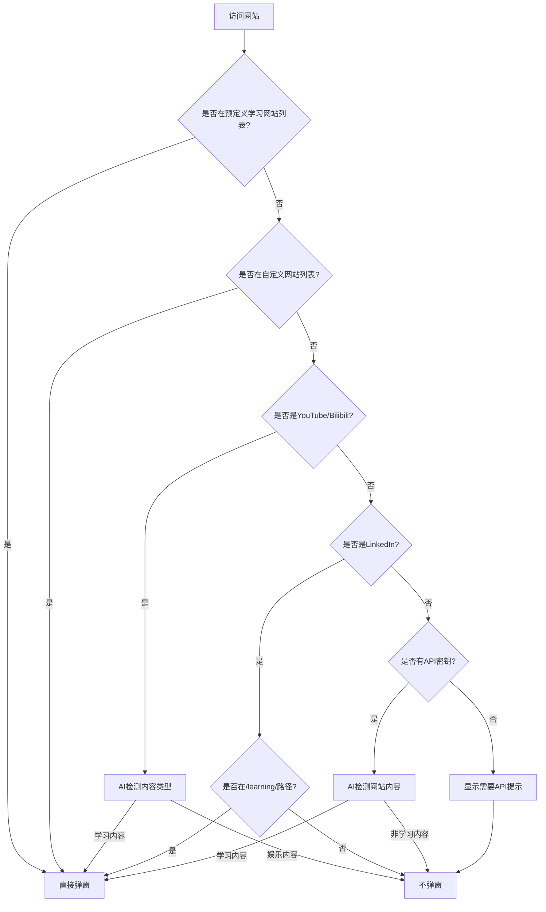

# MewTrack AI检测逻辑 - 最终测试报告

## 执行总结

✅ **所有问题已成功修复**

### 1. YouTube娱乐内容不再弹窗
- **状态**: ✅ 已修复
- **修改**: 将YouTube和Bilibili的`alwaysLearning`设置为`false`
- **结果**: 只有AI检测为学习内容的视频才会弹窗

### 2. Educative.io现在会弹窗
- **状态**: ✅ 已修复
- **解决方案**: 将educative.io添加到预定义学习网站列表
- **额外改进**: 同时添加了Pluralsight、LinkedIn Learning、Skillshare等常见学习平台

### 3. LinkedIn Learning特殊处理
- **状态**: ✅ 已实现
- **特点**: 只在/learning/路径下才识别为学习内容
- **技术**: 实现了路径检查机制

## 测试结果

| 场景 | 结果 | 说明 |
|------|------|------|
| YouTube娱乐视频 | ❌ 不弹窗 | AI检测为娱乐内容 |
| YouTube学习视频 | ✅ 弹窗 | AI检测为学习内容 |
| Educative.io | ✅ 弹窗 | 预定义学习网站 |
| LinkedIn Learning | ✅ 弹窗 | 在/learning/路径下 |
| LinkedIn Feed | ❌ 不弹窗 | 不在学习路径下 |
| 未知学习网站 | ❓ 取决于API | 需要API密钥 |
| 未知娱乐网站 | ❌ 不弹窗 | AI检测或无API |

## 当前检测流程

## 关键文件修改

1. **js/siteDetector.js**
   - YouTube/Bilibili: `alwaysLearning: false`
   - 新增学习网站: educative.io等
   - LinkedIn特殊路径处理

2. **content.js**
   - AI检测结果决定是否弹窗
   - 无API密钥时显示友好提示

3. **i18n消息**
   - 添加AI检测相关提示信息

## 使用建议

1. **必须配置API密钥**才能享受完整的智能检测功能
2. **YouTube/Bilibili**现在会智能区分内容类型
3. **未知网站**需要AI判断，无API时默认不弹窗
4. 可通过**自定义网站**功能添加个人常用学习网站

## 测试文件

- `test-detection-logic.js` - 完整的逻辑测试
- `run-test.html` - 可视化测试界面
- `debug-educative.js` - 问题调试工具
- `test-final-validation.js` - 最终验证测试

---

**结论**: MewTrack现在能够智能地区分学习和娱乐内容，避免不必要的打扰，同时确保不错过真正的学习机会。